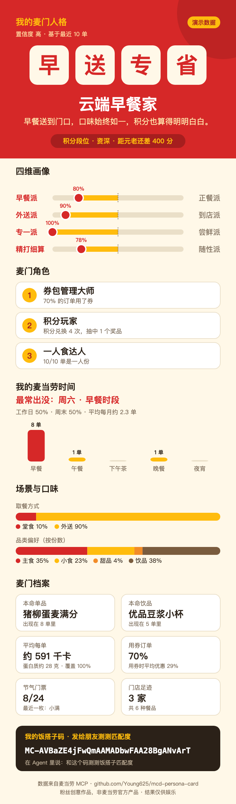
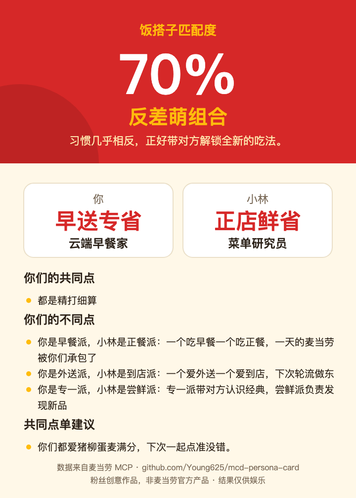

# 麦门人格卡 · 饭搭子匹配

> 你和朋友是「灵魂麦搭子」还是「反差萌组合」？
> 读一读你最近的麦当劳订单，生成一张专属麦门人格卡；再把饭搭子码发给朋友，随时测测你们是不是天生的麦搭子。

<p align="center">
  
  
</p>
<p align="center"><sub>以上示例均由仓库自带的虚构数据生成</sub></p>

## 项目介绍

这是一个基于 [麦当劳中国 MCP](https://open.mcd.cn/mcp) 开发的 Agent Skill，可以装进 Claude Code、WorkBuddy 等 Agent 使用，也可以直接在命令行运行。它综合 8 个只读 MCP 接口的数据（订单、订单详情、积分、奖品、券包、积分商城、营养成分、服务器时间），给你画一张麦门画像：

- **饭搭子匹配**：把约 30 个字符的饭搭子码发给朋友，随时算出你们的匹配度、搭子类型（灵魂麦搭子 / 默契饭友 / 互补拍档 / 反差萌组合）、异同点，以及「下次一起点什么」。分享码只包含统计结果，不含任何订单、门店或金额。
- **四维主人格**：从「早餐派/正餐派」「外送派/到店派」「专一派/尝鲜派」「精打细算/随性派」四个维度，把你归入 16 种麦门人格之一。
- **麦门角色**：18 种角色标签，例如节气收集家、早八元气派、券包管理大师、分享担当、堂食仪式感、无糖主义、一人食达人，挑出你最有特点的 3 个，每个都附带依据。
- **积分段位**：按累计积分分为萌新、常客、资深、元老、传奇，并显示距离下一段位还差多少分。
- **我的麦当劳时间**：最常出没的星期和时段、时段分布、工作日和周末的比例、平均每月几单。
- **场景与口味**：堂食、外带、外送、得来速的分布，品类偏好，本命单品和饮品，平均每单热量和蛋白质，用券比例。
- **权益提醒**：提示本月即将过期的积分和今天到期的券。

不管你最近点了 10 单还是一单没点，都能生成合适的卡片：订单少时会标注置信度，0 单时生成"待解锁"卡。

项目特点：**全程只读**，不会下单、领券、抽奖或扣积分；**零依赖**，只需要 Python 3.9；**本地运行**，没有服务器；**规则透明**，每个结论都能追溯到数据；**自带演示数据**，没有 Token 也能体验。

## 目标用户

- 常点麦当劳、想看看自己"麦门画像"的朋友
- 想找饭搭子、和同事朋友比一比口味的人
- 想参考如何基于 MCP 做一个完整 Skill 的开发者：MCP 客户端只有约 150 行标准库代码，人格计算全部是确定性规则，每个结论都能追溯到数据

## 安装方法

整个仓库就是一个 Skill：根目录的 [`SKILL.md`](SKILL.md) 是入口，[`scripts/`](scripts) 是代码，[`assets/`](assets) 是数据。把仓库放进 Agent 的技能目录就能用。

### 方式一：装进 Claude Code

```bash
git clone https://github.com/Young625/mcd-persona-card.git ~/.claude/skills/mcd-persona-card
```

重开一个 Claude Code 会话即可使用。

### 方式二：装进其他支持 Agent Skills 的工具

clone 到该工具的技能目录，通用位置是 `~/.agents/skills/`：

```bash
git clone https://github.com/Young625/mcd-persona-card.git ~/.agents/skills/mcd-persona-card
```

### 方式三：装进 WorkBuddy

1. 下载仓库并打包：
   ```bash
   git clone https://github.com/Young625/mcd-persona-card.git
   zip -r mcd-persona-card.zip mcd-persona-card -x '*/.git/*' '*/__pycache__/*'
   ```
2. 在 WorkBuddy 左侧打开【专家·技能·连接器】→【技能】→【添加技能】→【上传技能】，选择上一步生成的 `mcd-persona-card.zip`。
3. 推荐同时在【连接器】里添加麦当劳 MCP（配置见 [`mcp-config.example.json`](mcp-config.example.json)），这样 Skill 可以直接通过连接器读取数据，脚本不需要接触你的 Token。

### 配置 MCP Token

1. 在 [open.mcd.cn/mcp](https://open.mcd.cn/mcp) 用手机号登录，到控制台激活并复制 MCP Token。
2. 任选一种方式提供给脚本，**不要把 Token 发到 Agent 的对话里**：
   - 环境变量：`export MCD_MCP_TOKEN=你的Token`
   - 配置文件：写入 `~/.mcd-persona-card/.env`，内容为 `MCD_MCP_TOKEN=你的Token`
3. 检查连接：
   ```bash
   python3 ~/.claude/skills/mcd-persona-card/scripts/run.py check
   ```

如果你的 Agent 已经通过连接器接入了麦当劳 MCP，可以跳过这一步，Skill 会让 Agent 自己取数据。没有 Token 也可以先用演示数据体验。

## 使用示例

### 在 Agent 里对话

| 你说 | Skill 会做什么 |
|---|---|
| 生成我的麦门人格卡 | 读取你的订单和积分，生成人格卡和饭搭子码 |
| 先用演示数据看看效果 | 用虚构数据生成一张示例卡片 |
| 我朋友的码是 MC-xxxx，看看我们是不是饭搭子 | 计算匹配度，生成匹配卡 |

### 在命令行运行

在仓库目录下执行（`scripts/run.py` 也可以用绝对路径从任何目录调用）：

```bash
# 演示数据，不需要 Token
python3 scripts/run.py card --demo --open

# 生成你自己的人格卡
python3 scripts/run.py card --name 你的昵称 --open

# 和朋友的码匹配（用你上次拉取的数据，不重复请求接口）
python3 scripts/run.py match MC-朋友的码 --friend-name 小林 --cached --open

# 直接比较两个码
python3 scripts/run.py match MC-码A MC-码B --name 小王 --friend-name 小林
```

演示数据的输出示例（节选）：

```text
你的麦门人格：早送专省 · 云端早餐家
  早餐送到门口，口味始终如一，积分也算得明明白白。
积分段位：资深（累计 2600 分，距元老还差 400 分）

四维画像（基于最近 10 单，2026-06-03 ~ 2026-09-26，置信度 高）：
  早餐派  ████████░░ 正餐派  → 早餐派
       最近 10 单中有 8 单在 10:30 前下单
  外送派  █████████░ 到店派  → 外送派
       最近 10 单中有 9 单是外送
  专一派  ██████████ 尝鲜派  → 专一派
       100% 的订单里有回头单品，共吃过 6 种餐品
  精打细算 ████████░░ 随性派  → 精打细算
       70% 的订单用了券，积分利用率 90%

麦门角色：
  1. 券包管理大师：70% 的订单用了券
  2. 积分玩家：积分兑换 4 次，抽中 1 个奖品
  3. 一人食达人：10/10 单是一人份

我的麦当劳时间：
  最常出没：周六 · 早餐时段
  时段分布：早餐 80% · 午餐 10% · 晚餐 10%
  工作日 50% · 周末 50% · 平均每月约 2.3 单

场景与口味：
  取餐方式：堂食 10% · 外送 90%
  品类偏好：主食 35% · 小食 23% · 甜品 4% · 饮品 38%

麦门档案：
  本命单品：猪柳蛋麦满分（出现在 8 单里）
  本命饮品：优品豆浆小杯
  平均每单：约 591 千卡，蛋白质约 28 克（按可识别餐品计算，覆盖 100%）
  用券订单：70%，用券时平均优惠 29%
  节气门票：8/24（立春、雨水、惊蛰、春分、清明、谷雨、立夏、小满）
  门店足迹：3 家
提示：券包里有 1 张券今天到期

你的饭搭子码：MC-AVBaZE4jFwQmAAMADbwFAA28BgANvArT
```

卡片保存在 `~/.mcd-persona-card/out/`，用浏览器打开后可以下载 PNG。

### 命令一览

| 命令 | 说明 |
|---|---|
| `card` | 生成人格卡 |
| `match CODE [CODE2]` | 饭搭子匹配。传一个码时和你自己的数据比较，传两个码时直接比较；`--friend-name` 设置对方昵称 |
| `check` | 检查 Token 和 MCP 连接 |

`card` 和 `match` 共用的参数：

| 参数 | 作用 |
|---|---|
| `--demo` | 使用演示数据 |
| `--cached` | 使用上次实时拉取的缓存 |
| `--input FILE` | 读取 Agent 通过连接器取到的数据文件 |
| `--name` | 设置你的昵称 |
| `--out` | 指定输出目录 |
| `--open` | 生成后用浏览器打开 |

## 人格是怎么算出来的

### 四维主人格

| 维度 | 判定规则 |
|---|---|
| 早餐派 / 正餐派 | 10:30 前下单的订单占一半以上，就是早餐派 |
| 外送派 / 到店派 | 外送订单占一半以上，就是外送派 |
| 专一派 / 尝鲜派 | 一半以上的订单里出现了"之前也点过"的餐品（不算饮品），就是专一派 |
| 精打细算 / 随性派 | 用券订单占比（权重 60%）和积分利用率（权重 40%）综合超过一半，就是精打细算 |

四个维度组合成 16 种人格：

| | 早·送 | 早·店 | 正·送 | 正·店 |
|---|---|---|---|---|
| **专·省** | 云端早餐家 | 晨光守序者 | 精算外送官 | 本命守护者 |
| **专·随** | 被窝早餐派 | 晨间老主顾 | 宅家本命派 | 老地方老味道 |
| **鲜·省** | 晨间点单策略家 | 晨光探索家 | 外送尝鲜官 | 菜单研究员 |
| **鲜·随** | 早安惊喜派 | 早餐漫游者 | 宅家美食冒险家 | 随心探店家 |

### 麦门角色和积分段位

18 种角色的判定规则见 [`MCP_INTEGRATION.md`](MCP_INTEGRATION.md#42-麦门角色18-种最多展示-3-个)，例如"≥ 50% 的订单是工作日早餐"就是早八元气派。积分段位按累计积分划分：萌新（0）、常客（300）、资深（1000）、元老（3000）、传奇（8000）。

### 订单多少都能用

| 最近订单数 | 置信度 | 卡片 |
|---|---|---|
| 6～10 单 | 高 | 完整卡片 |
| 3～5 单 | 中 | 完整卡片 |
| 1～2 单 | 低 | 标注"初步判定" |
| 0 单 | 待解锁 | "麦门新朋友"卡，展示积分段位、节气门票等 |

几点说明：

- 麦当劳 MCP 的 `order-list` 目前只返回**最近 10 单**，所以这是一张"近期画像"。
- 数据不足的维度会如实显示"数据不足"；营养数据覆盖率低于 60% 时不展示；最常出没的时段并列时如实显示。
- 匹配度的算法：四维相似度占 60%，品类偏好相似度占 30%，有共同本命单品再加 10 分。

完整的数据流程、用到的 Tool 和字段见 [`MCP_INTEGRATION.md`](MCP_INTEGRATION.md)。

## 隐私与安全

- 只调用 8 个查询类 Tool，不调用任何下单、领券、抽奖、兑换类 Tool。
- 所有计算都在你的电脑上完成，没有服务器，不上传任何数据。
- 采集时立即丢弃门店名称和地址、取餐码、支付单号、订单备注和金额，只保留取餐方式、用券张数和优惠比例。
- 卡片、分享码和命令输出里都**不包含**金额、门店名称、订单号、账户 ID；门店只显示数量，优惠只显示比例。
- Token 只从环境变量或 `.env` 文件读取；缓存和卡片保存在 `~/.mcd-persona-card/`，不会写进仓库或你当前的项目。

## 项目结构

```
mcd-persona-card/
├── SKILL.md                  Skill 入口：Agent 使用说明
├── README.md                 项目介绍（参赛必需）
├── CONTEST_DECLARATION.md    参赛声明（参赛必需）
├── MCP_INTEGRATION.md        MCP 接入说明（参赛必需）
├── mcp-config.example.json   MCP 配置示例（参赛必需）
├── scripts/
│   ├── run.py                命令行入口
│   └── mcd_persona/
│       ├── mcp_client.py     MCP Streamable HTTP 客户端（标准库实现）
│       ├── collect.py        调用只读 Tool、精简数据、本地缓存
│       ├── catalog.py        餐品分类、营养数据解析与匹配
│       ├── features.py       统计指标
│       ├── persona.py        四维人格、麦门角色、积分段位
│       ├── share_code.py     饭搭子码编码和解码（带校验位）
│       ├── match.py          匹配算法
│       ├── render.py         SVG 卡片 + 可下载 PNG 的 HTML 页面
│       ├── paths.py          路径管理
│       └── cli.py            命令行参数
├── assets/
│   ├── personas.json         16 种人格文案
│   └── demo.json             虚构的演示数据
└── docs/                     README 示例图
```

## 参赛说明

本项目参加 [麦当劳程序员创意开发大赛](https://github.com/M-China/mcd-developer-innovation-challenge)，参赛声明见 [`CONTEST_DECLARATION.md`](CONTEST_DECLARATION.md)，MCP 接入说明见 [`MCP_INTEGRATION.md`](MCP_INTEGRATION.md)，MCP 配置示例见 [`mcp-config.example.json`](mcp-config.example.json)。

本项目是参赛者独立开发的粉丝创意作品，**非麦当劳官方产品**。结果仅供娱乐，不构成营养或其他专业建议；餐品信息、价格及供应状态以麦当劳官方渠道为准。

如果你觉得有意思，欢迎点个 ⭐ Star，也欢迎晒出你的人格卡！

## License

[MIT](LICENSE)
